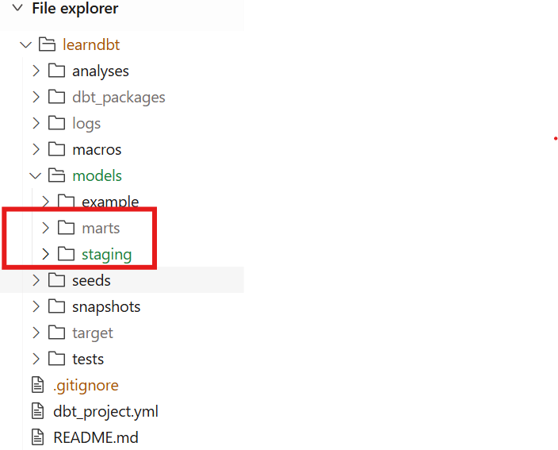

# Create folder structure under models folder

Create 2 folders staging and marts under models



# Create staging models
## Create a _source.yaml file
Under staging folder, create a _source.yaml file the contain information about data source as following:
```yml
version: 2

sources:
  - name: wide_world_importers
    database: gcp-data-eng-499102
    dataset: wide_world_importers
    tables: 
      - name: sales__customers
```

## Create a new customer model
Under staging folder, create a new stg_customer.sql file
```sql
{{config(materialized='view')}}

SELECT 
    *
FROM {{source('wide_world_importers','sales__customers')}}
WHERE
    customer_id is not null
```

## Create a test for customer model
Under staging folder, create a new stg_customers.yaml
```yml
  models:
    - name: stg_customers
      columns:
        - name: customer_id
          data_tests:
            - unique
            - not_null
```

then, run dbt command
```
dbt build --select stg_customers.sql
```

## Create Order model and test
Add "sales__orders" into _source.yaml
```yaml
version: 2

sources:
  - name: wide_world_importers
    database: gcp-data-eng-499102
    dataset: wide_world_importers
    tables: 
      - name: sales__customers
      - name: sales__orders
```

Under staging folder, create a new stg_orders.sql
```sql
{{config('materialzed','view')}}

SELECT * 
FROM {{source('wide_world_importers','sales__orders')}}
WHERE
    order_id is not NULL  
```

Create a test file stg_orders.yaml
```yaml
  models:
    - name: stg_orders
      columns:
        - name: order_id
          data_tests:
            - unique
            - not_null

```

then run command
```
dbt build --select stg_orders.sql
```

## Create sales order lines model
follow the same steps above to create sales order lines model


# Create a fact model
## Create a fact_sales_order model
Under mart folder, create a fact_sales_order

```sql
{{config('materialized','table')}}
select 
    c.customer_id,
    c.customer_name,
    count(o.order_id) as total_orders,
    sum(ol.quantity) as total_items
from {{ref('stg_customers')}} as c
left join {{ref('stg_orders')}} as o
    on c.customer_id = o.customer_id
left join {{ref('stg_order__lines')}} as ol
    on o.order_id = ol.order_id
group by c.customer_id, c.customer_name
```

## Create a test for relationship 
Create a test relationship between stg_customers and stg_oders
```yml
  models:
    - name: stg_customers
      columns:
        - name: customer_id
          data_tests:
            - unique
            - not_null
            - relationships:
              field: customer_id
              to: ref('stg_orders')
```